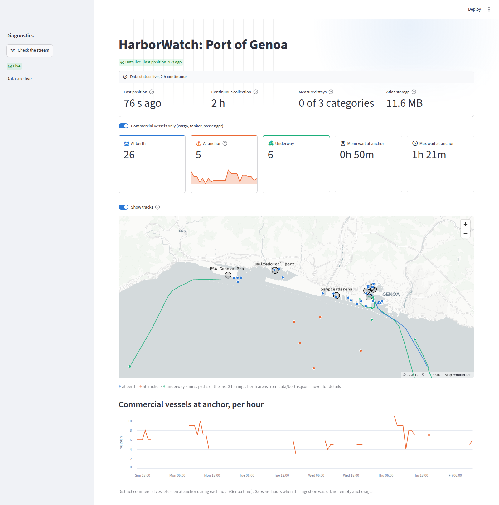
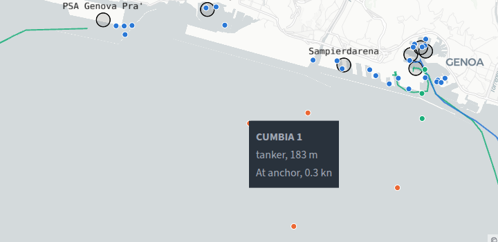
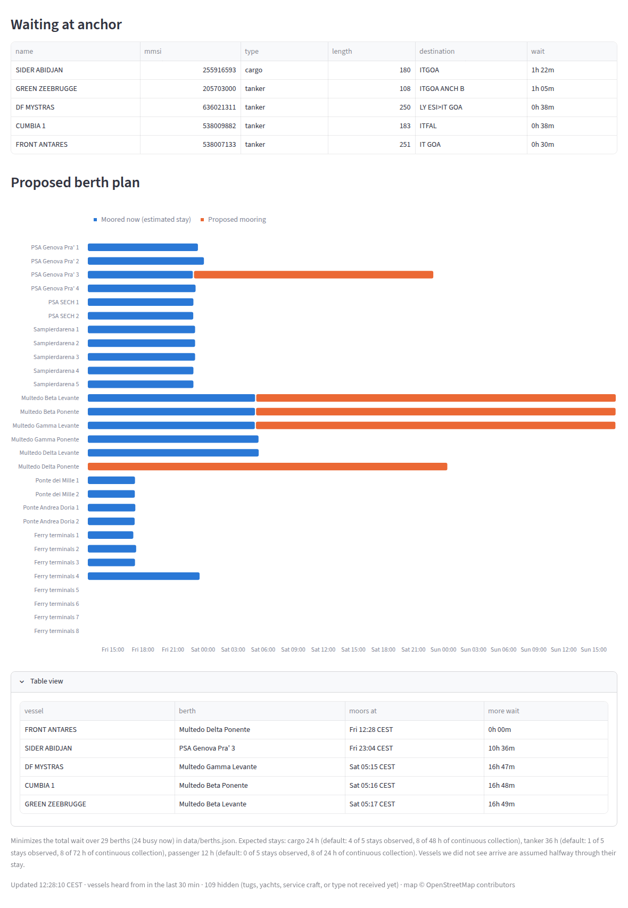

# HarborWatch

[](https://github.com/GiuseppeSaluto/HarborWatch/actions/workflows/tests.yml)

Real-time port congestion monitor and berth allocation optimizer for the Port of Genoa, built on live AIS ship-tracking data.



## What it does

- **Monitors the port live.** Every vessel in the port area is classified as *at berth*, *at anchor* or *underway*, and the dashboard shows the counts, a map with the paths of the vessels that moved in the last 3 hours, and how long commercial vessels have been waiting at anchor.
- **Tracks congestion over time.** An hourly series of commercial vessels at anchor, with gaps where no data was collected rather than misleading zeros.
- **Proposes a berth plan.** A constraint-programming model (OR-Tools CP-SAT) assigns every waiting vessel a compatible berth and a mooring time, minimizing the total wait, around the vessels already moored.
- **Says how far to trust itself.** A status badge and panel show data freshness, continuous collection time, which stay durations are measured and which are still defaults, and database usage. Vessels the plan cannot place are listed, not dropped.
- **Diagnoses its own outages.** When data stop, a sidebar check tells which link broke: the database, the ingestion, or the AIS feed itself (no coverage over the port, or the service down).

Hovering the map shows each vessel's name, type, length, state and speed, and each berth area's berths and accepted vessel types:



Below the map, the vessels waiting at anchor and the proposed berth plan, with its table view opened:



## How it works

```
AISStream (WebSocket) ──> ingest.py ──> MongoDB Atlas ──> app.py (Streamlit)
                          validate        positions          map, counters,
                          classify        vessels            congestion chart,
                          sample, batch   states             berth plan
                                              │
                                              └──> optimize.py (OR-Tools CP-SAT)
```

- **Ingestion** (`src/ingest.py`): an asyncio client subscribes to the port's bounding box on [AISStream](https://aisstream.io), validates every message (AIS uses sentinel values such as latitude 91 for "not available") and writes to MongoDB with PyMongo's async API. It reconnects on its own and flushes its buffers on shutdown.
- **Classification** (`src/classify.py`): a vessel is *underway* above 0.5 knots; otherwise it is *at berth* when within 100 m of the coastline, whose OpenStreetMap trace follows the quay edges in Genoa, and *at anchor* when further out. The AIS ship type separates commercial traffic (cargo, tanker, passenger) from tugs, pilot boats and yachts: during the 2026 Genoa Boat Show dozens of 50-90 m superyachts were moored in port, and length alone could not tell them from cargo ships.
- **Storage under free-tier limits**: MongoDB Atlas M0 allows 512 MB and 100 operations per second. Positions are sampled to one per vessel per minute, written in batches every 10 seconds, and expire after 7 days through a TTL index. The ingestion logs the used and projected storage (about 70 MB at steady state, measured).
- **State history**: each vessel's current state is upserted with the time it began, computed inside MongoDB with a pipeline update so that it survives restarts. After a gap in the data the start time is reset and flagged as "not seen", instead of silently counting the gap as waiting time.
- **Berth plan** (`src/optimize.py`): berths come from `data/berths.json`, 29 berths with their length and accepted vessel categories, each marked as official or observed. Each waiting vessel gets an optional interval on every compatible berth; `NoOverlap` per berth keeps one vessel at a time, including the vessels already moored. Expected stays are measured from complete stays in the history once a category has enough of them, seen in a continuous collection window at least twice its default stay (in a few-hour window only short stays can be seen from start to end), and fall back to per-category defaults until then.

## Run it

Requirements: Python 3.12+, a free [AISStream](https://aisstream.io) API key, and a MongoDB Atlas cluster (the free M0 tier is enough) with your IP in its access list.

```bash
python3 -m venv .venv && . .venv/bin/activate
pip install -r requirements.txt
cp .env.example .env           # then fill in AISSTREAM_API_KEY and MONGODB_URI
./run.sh
```

`run.sh` starts the ingestion in the background and the dashboard at http://localhost:8501; Ctrl+C stops both. Some public networks block outbound port 27017, which makes Atlas unreachable.

## Tests

```bash
pytest
```

The suite runs in under a second, without network or database, on every push (GitHub Actions, Python 3.12 and 3.14). It covers message validation, classification thresholds and the coastline distance, the berth data, the optimizer (expected optima checked by brute force on small cases), berth occupancy, stay measurement and the hourly history behind the charts. The tests are written by a separate agent from the specification alone, without reading the implementation; the code adapts to them. `tests/check_stays_pipeline.py` checks against a real MongoDB that the aggregation finding the stays agrees with the tested Python definition.

## Known limitations

- **The berth plan is a deterministic model.** No tides, drafts, pilotage windows or commercial priorities (a tanker may wait at anchor for a cargo window even with a berth free); berths are one point per terminal area. Berth data is official where published (the six Multedo oil berths, PSA terminals, cruise piers) and observed elsewhere; observed values can only be lower bounds, so a vessel that fits no known berth is listed as not planned rather than dropped.
- **Stay durations are defaults until enough history exists.** Container and tanker calls last one or two days, so measuring them needs days of uninterrupted collection.
- **Vessels moored before the ingestion started** are assumed to be halfway through their stay.
- **Classification is heuristic.** A slow manoeuvring vessel can be misclassified, a vessel waiting near a quay counts as at berth, and AIS coverage has gaps. These corners are marked `Known limit:` in the code, each with its upgrade path.

## Project layout

```
src/        ingest.py, classify.py, optimize.py, history.py, app.py, config.py
data/       coastline.json (OSM coastline), berths.json (berths of the port)
tests/      one test file per module with non-trivial logic, plus recorded AIS messages
run.sh      ingestion + dashboard in one command
```

## Data

- Vessel positions: [AISStream](https://aisstream.io) live AIS feed.
- `data/coastline.json` is the OpenStreetMap coastline around the port, © OpenStreetMap contributors, available under the [ODbL](https://www.openstreetmap.org/copyright).
- `data/berths.json` combines quay lengths published by the [Port Authority of Genoa](https://www.portsofgenoa.com) with values observed in the collected data, as noted in each entry.
